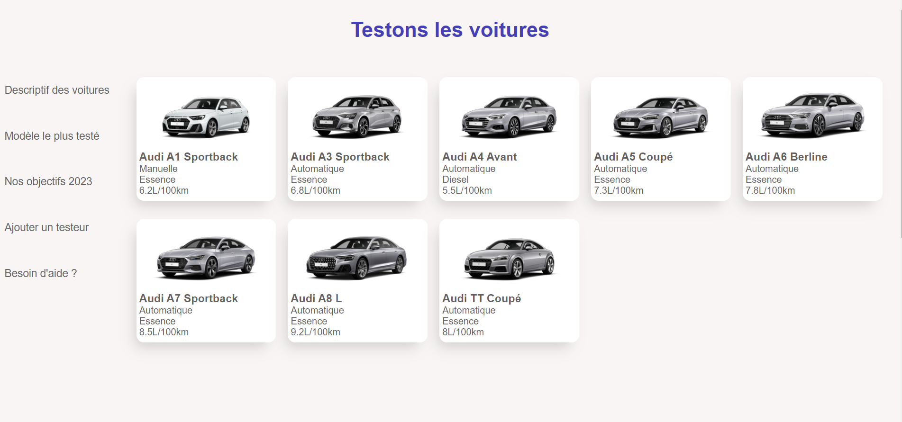

# Projet React JS-MongoDB - Concession Automobile
The aim of this project is to get to grips with a web interface created using an Express JS API and to learn how to manage a mongoDB database.

For this project, we decided to create a car-related database. Initially, we wanted to simulate a car dealership and therefore sell cars in the same way as we had done with the sports shop. But following group discussions we concluded that redesigning a sales system, even on a different subject, wasn't original enough. So we decided to make a test manager for cars. In other words, our database and our interface will allow the user to consult cars and the tests that have been carried out on them, as well as being able to add cars and tests. We think that this subject is quite original and allows us to show what we have learnt.

## Getting started
```
git clone https://github.com/GourmelenT/projet-react-JS-MongoDB.git
git branch -M main
git remote add origin https://github.com/GourmelenT/projet-react-JS-MongoDB.git
git push -u origin main
```

## Before continuing, check that you have installed [node](https://nodejs.org/en/download) and [npm]() :
```
node -v
npm --version
```

## Next, we'll install all the necessary dependencies:
```
npm i express
npm i mongoose
npm i -g nodemon
```

## Finally, we'll launch the project in the project with the following command:
```
nodemon server.js
```
<div class="pull-right"> 
    <center>
    
    </center>
</div>
